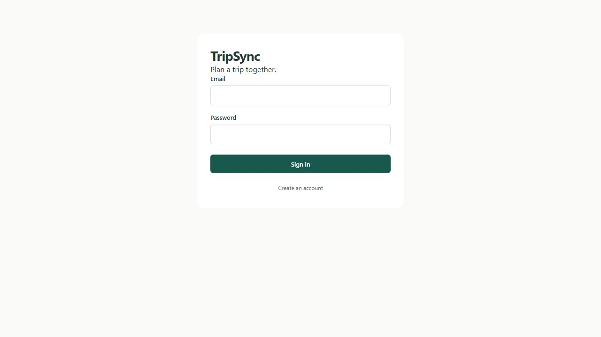
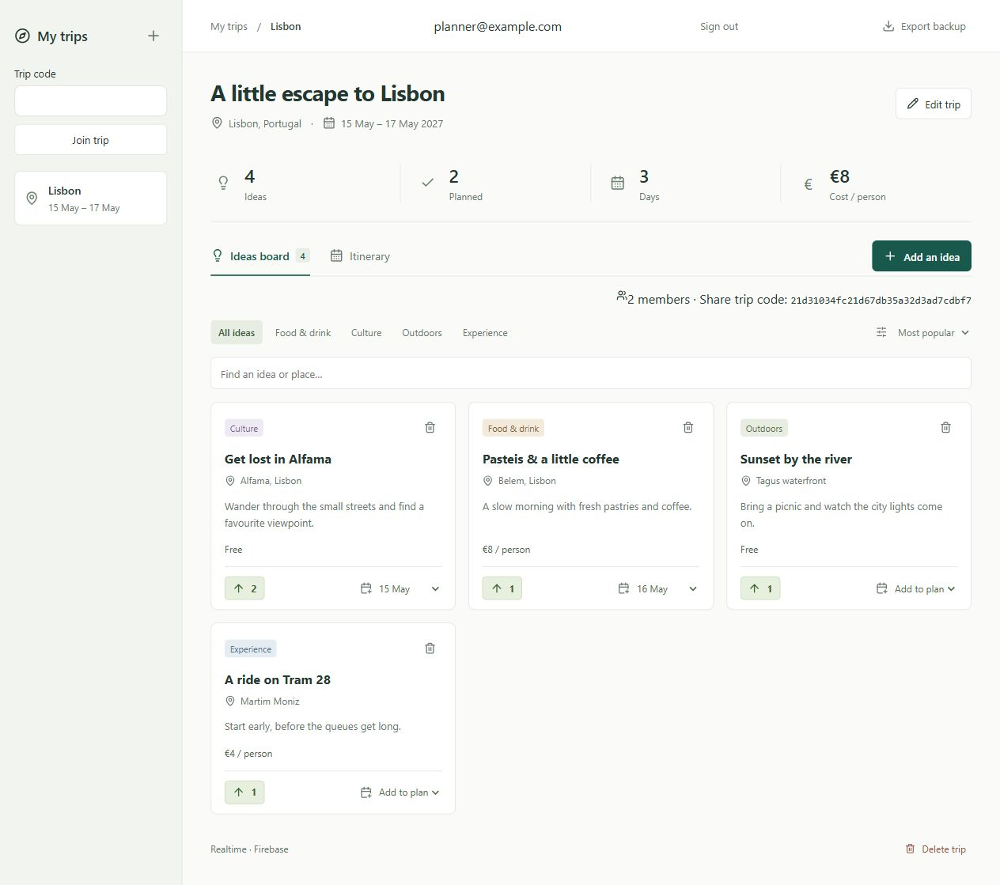
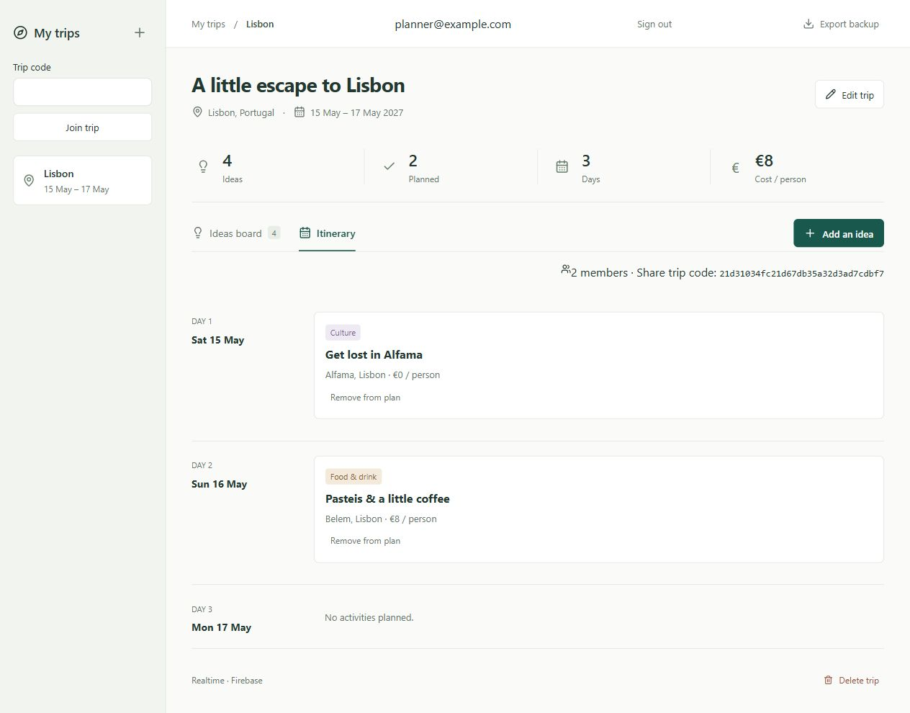
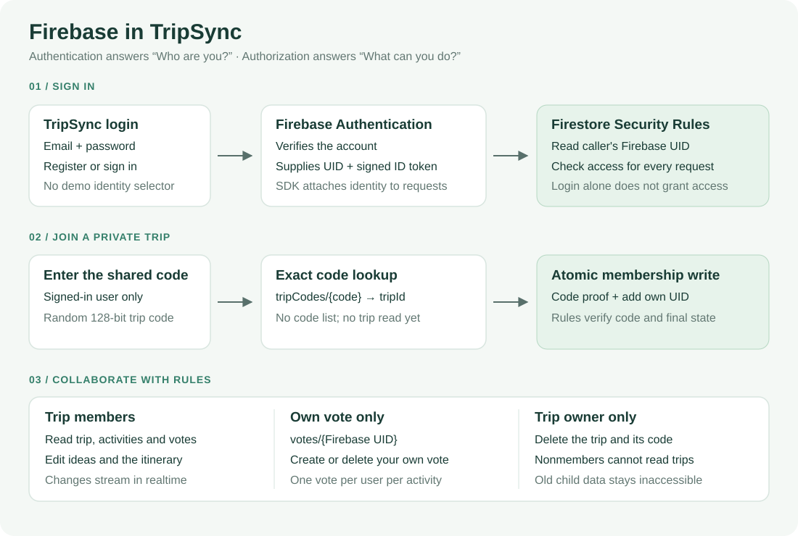

# TripSync

React, TypeScript trip planner with Firebase Authentication and Firestore.

- Register, sign in and sign out with email/password.
- Create trips, share a random trip code, join as a signed-in user (up to 8 members).
- Add ideas, vote once per Firebase UID, filter and schedule a daily itinerary.
- Trips, activities and votes update in realtime. Only members can access trip data; only the owner can delete a trip.
- Costs are per person in EUR. JSON export remains available; no import or local demo data.

## A quick walkthrough

Screenshots below show the real app connected to local Firebase emulators, using disposable example accounts and a sample trip. The trip code in the screenshots belongs only to that temporary local session.

### 1. Register or sign in

Create an account with email and password, then sign in. Firebase Authentication supplies the UID used for membership and voting. Sign out is available in the top bar.

| Sign in                                                                | Registration                                                                   |
| ---------------------------------------------------------------------- | ------------------------------------------------------------------------------ |
|  |  |

### 2. Share a trip and vote together

Create a trip and share the code shown above the ideas board. Another signed-in user enters it in **Trip code → Join trip**. Members see the same ideas, votes and schedule in realtime. Each vote belongs to the signed-in account; there is no identity switcher.



### 3. Build the daily itinerary

Use **Add to plan** on an idea to choose its day, then open **Itinerary**. Other members receive schedule changes automatically.



### How Firebase login and authorization work



**Authentication** verifies the account and supplies its Firebase UID. **Authorization** is enforced by Firestore Security Rules on database requests:

- Only trip members can read the trip, activities and votes or edit the plan.
- A member can create or remove only their own `votes/{uid}` document, giving each account one vote per activity.
- Only the owner can delete the trip and its sharing code.
- Joining starts with an authenticated exact code lookup, then an atomic code-proof and membership write. It does not require public trip reads or a public list of codes.

## Setup

Use Node.js 22.12+ and pnpm 10.11.0. Install with `pnpm install --frozen-lockfile`.

1. Create a Firebase project and register a **Web app** in Firebase Console.
2. Enable **Authentication → Sign-in method → Email/Password**. Add your deployed hostname under Authentication → Settings → Authorized domains (add localhost for local development if needed).
3. Create a **Cloud Firestore database (Standard edition, default database)**. Choose its region; do not use public/test rules.
4. Copy `.env.example` to `.env.local` and fill these values from the Web app's Firebase config:
   - `VITE_FIREBASE_API_KEY` ← `apiKey`
   - `VITE_FIREBASE_AUTH_DOMAIN` ← `authDomain`
   - `VITE_FIREBASE_PROJECT_ID` ← `projectId`
   - `VITE_FIREBASE_APP_ID` ← `appId`
5. Run `pnpm exec firebase login`, then deploy the included rules: `pnpm exec firebase deploy --only firestore --project YOUR_PROJECT_ID`.
6. Start `pnpm dev`. Restart after changing environment values. Configure the same variables at build time on your static host; serve `dist/` after `pnpm build`.

Missing config displays a setup screen. No Firebase project credentials are included. `.env*` files except the example are ignored. Never add service account keys or passwords. Firebase Web config is client-visible and does not replace Security Rules.

## Checks and local emulators

```sh
pnpm test
pnpm test:rules
pnpm build
```

Rules tests use an isolated `demo-tripsync` project; no production config/login is needed. Java 21+ is recommended (Firebase CLI 14 supports Java 17; newer CLI/emulator versions may require 21). Tests cover member-only reads, filtered queries, atomic join with a code, forged membership, own UID votes, validation, owner-only deletion and private orphan data. CI runs these tests and the build.

To use the app locally without a Firebase project, put these dummy values in `.env.local`:

```dotenv
VITE_FIREBASE_API_KEY=demo-api-key
VITE_FIREBASE_AUTH_DOMAIN=demo-tripsync.firebaseapp.com
VITE_FIREBASE_PROJECT_ID=demo-tripsync
VITE_FIREBASE_APP_ID=1:123:web:demo
VITE_USE_FIREBASE_EMULATORS=true
```

Run `pnpm emulators` in one terminal and `pnpm dev` in another. Register accounts in the local app; open a second browser profile to test sharing and realtime collaboration. Emulator data is temporary. Keep `VITE_USE_FIREBASE_EMULATORS=false` for production.

## Architecture and limits

Components → `usePlanner` → Firestore repository, retaining domain types and Zod form validation. See [architecture](docs/ARCHITECTURE.md).

Trips use member UID arrays. Activities and UID-keyed votes are separate documents. Code lookups allow authenticated exact gets only; code listing and public trip reads are denied. Joining atomically writes a self-owned code proof and adds only the caller's UID. Codes have 128 bits of cryptographic randomness; treat them as invitations and share privately. All members can edit the plan; there is no role-management UI.

Deleting a trip atomically removes its trip document and code. Firestore does not cascade subcollection deletion: activity/vote/proof documents remain inaccessible because rules require an existing parent trip. Deleting an idea similarly leaves inaccessible vote documents. Physical cleanup is an administrative operation outside this MVP. There are no email invitations, roles, migrations/imports or password reset flow.

[MIT](LICENSE)

Permanent `tripIds` and `activityIds` reservations prevent reusing deleted IDs to expose old subcollections or resurrect votes. These markers cannot be read, edited or deleted by clients.
