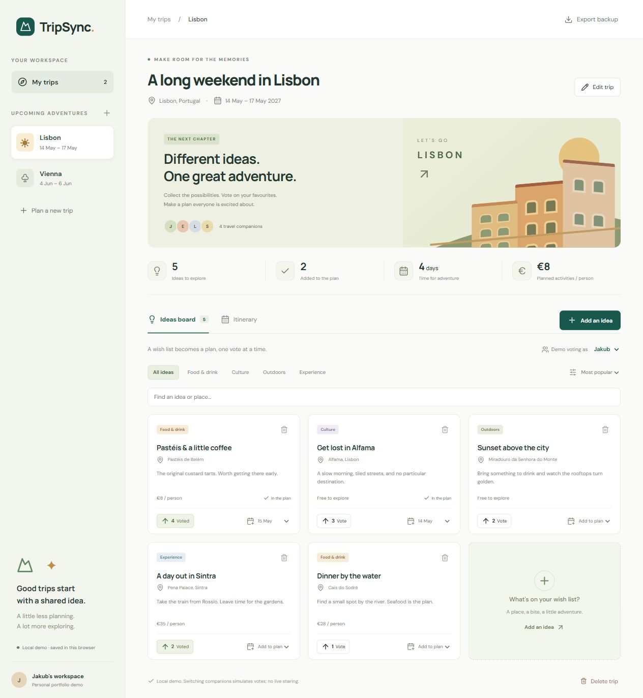

# TripSync

A small group-trip planner built with **React, TypeScript, and Vite**. Collect ideas, vote on activities, and build a day-by-day itinerary.



Built as a student portfolio project to demonstrate modern frontend development relevant to the Lexaru role described in the project brief. This is an independent project, not affiliated with Lexaru.

## MVP

- Create, edit, and delete trips with destinations, dates, and up to eight companions.
- Suggest places and activities with categories, notes, and per-person cost.
- Toggle one vote per demo member; rank ideas by votes or cost.
- Search and filter suggestions; schedule them on any day of the trip.
- View a daily itinerary and the total cost of scheduled activities per person.
- Persist validated data in localStorage; export a JSON snapshot.
- Responsive layout, labelled form controls, keyboard-accessible dialogs, and visible focus states.

**Collaboration is simulated.** Companion selection changes the voting identity on this device. There are no accounts, invitations, cross-device sync, or Firebase integration in this release. The interface explicitly identifies this as a local demo. Export is a downloadable snapshot; a restore/import UI is not implemented.

## Run locally

Use Node.js 22.12+ and pnpm 10.11.0 (install with `npm install -g pnpm@10.11.0`).

```sh
pnpm install --frozen-lockfile
pnpm dev
```

Open the address Vite prints. Sample Lisbon and Vienna trips are loaded when no saved data exists. All costs are EUR and refer only to activities, not transport or accommodation. Dates and amounts are examples.

```sh
pnpm test       # domain, persistence, and React interaction tests
pnpm build      # strict TypeScript checks + production bundle
pnpm preview   # serve the production bundle locally
```

The app can be served from a subdirectory (`base: './'`). Fonts are loaded from Google Fonts with system-font fallbacks; all planning functions work without that request.

## Architecture

```text
src/
  components/     ActivityCard, forms, accessible modal
  domain/         Zod schemas, TypeScript types, pure planner reducer
  data/           Sample data and a browser repository
  hooks/          usePlanner: React state + persistence orchestration
  App.tsx         Workspace, ideas board, itinerary, UI state
  styles.css      Responsive design
docs/
  ARCHITECTURE.md MVP decisions, invariants, Firebase migration plan
  CV.md           Accurate CV entry and interview talking points
```

The reducer validates every resulting state. Tests cover votes, invalid schedules, date boundaries, damaged storage, storage denial, creation/deletion, filtering, scheduling, and reload persistence. GitHub Actions runs tests and a production build on pushes and pull requests.

## Publish on GitHub

Upload **the contents of this directory** as the repository root, so `.github/workflows/ci.yml` runs correctly. Commit `pnpm-lock.yaml`; leave `node_modules`, `dist`, and environment files ignored. Include a screenshot and live demo URL in this README once you publish it.

For static hosting, build with `pnpm build`, then publish `dist/`. Follow [Vite's deployment guide](https://vite.dev/guide/static-deploy.html) for GitHub Pages or another static host. No backend or secrets are needed for this MVP. This delivery creates the local project; it does not create a remote repository or public deployment.

## Next milestone: real collaboration

Implement Firebase Authentication and Firestore behind a new repository, use authenticated UID-based votes, membership-based security rules, subscriptions, and transactions. Test unauthorized access and simultaneous votes in the Firebase Emulator Suite before describing the project as realtime. See [architecture notes](docs/ARCHITECTURE.md).

## Learning references

- [React with TypeScript](https://react.dev/learn/typescript)
- [React reducer patterns](https://react.dev/reference/react/useReducer)
- [Vite guide](https://vite.dev/guide/)
- [Vitest guide](https://vitest.dev/guide/)

## License

MIT. See [LICENSE](LICENSE). Replace the copyright attribution when making the project your own.
